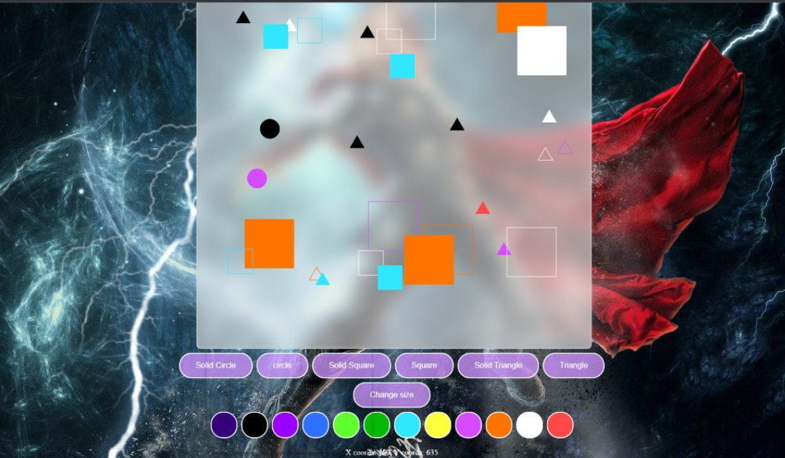
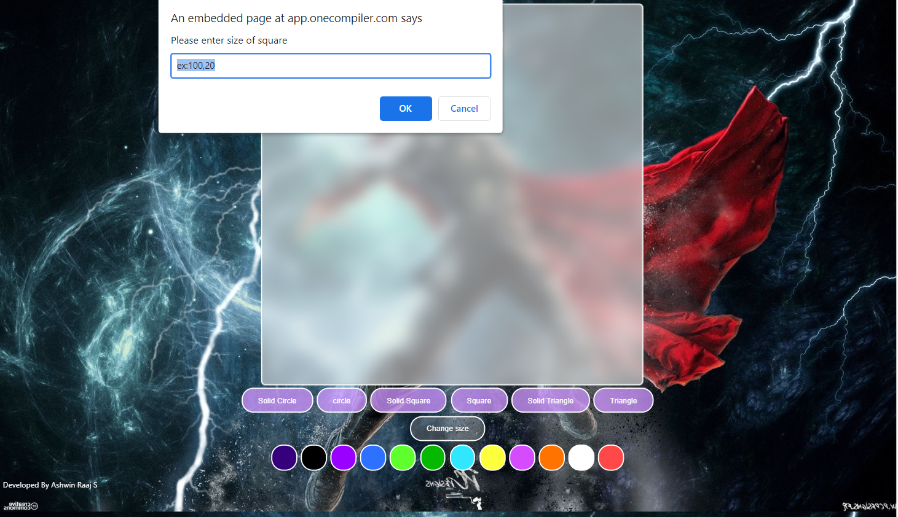
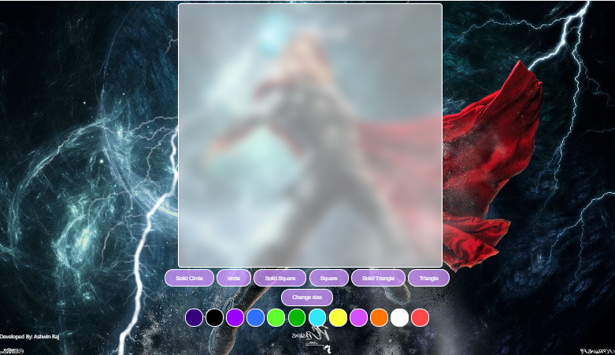

# Web Page for Paint Application

## AIM:

To design a static website for Paint Application using HTML5 canvas.

## DESIGN STEPS:

### Step 1:

Requirement collection.

### Step 2:

Creating the layout using HTML,CSS and canvas.

### Step 3:

Write javascript to capture move events.

### Step 4:

Perform the drawing operation based on the user input.

### Step 5:

Validate the layout in various browsers.

### Step 6:

Validate the HTML code.

### Step 6:

Publish the website in the given URL.

## PROGRAM :
~~~
[9:11 pm, 24/01/2022] Shriram Sec: <!DOCTYPE html>
<html lang="en">

<head>
  <meta charset="UTF-8">

  <meta http-equiv="X-UA-Compatible" content="IE=edge">
  <meta name="viewport" content="width=device-width, initial-scale=1.0">
  <title>Volume Calculator</title>
</head>

<body>

  

    <h1><small>Volume Calculator For Cylinder And Cone</small></h1>
  

  

    

      <h1>Volume Of Cylinder</h1>
      <form>
        

          <lable for="aedit">Height:</lable>
          <input id="aedit" placeholder="" />
          <label><small>
              Meters
            </small></label>
        
 
        

          <lable for="bedit">Radius:</lable>
          <input id="bedit" placeholder="" />
          <label><small>
              Meters
            </small></label>
        
 
        

          <lable for="cedit">Volume:</lable>
          <input type="number" min="0" value="0" step="any" id="cedit" placeholder="0" readonly="0" /><label><small>
              Meters³</small></label>
        
  
        

          <input type="button" class="button" value="CALCULATE" id="calbutton1" />
          <input type="Reset" class="button" value="RESET">
        

        

          

        

         
        

          Formula is
          Volume V = π X Radius² X Height
        
 
      </form>
    

    

      <h1>Volume of Cone</h1>
      <form>
        

          <lable for="radiusedit">Radius:</lable>
          <input id="radiusedit" placeholder="" />
          <label><small>
              Meters
            </small></label>
        
 
        

          <lable for="heightedit">Height:</lable>
          <input id="heightedit" placeholder="" />
          <label><small>
              Meters
            </small></label>
        
 
        

          <lable for="volumeedit">Volume:</lable>
          <input type="number" min="0" value="0" name="avol" step="any" id="volumeedit" placeholder="0"
            readonly="0" /><label><small> Meters³</small></label>
        
  
        

          <input type="button" class="button" value="CALCULATE" id="calbutton2" />
          <input type="Reset" class="button" value="RESET">
        
 
        

          

        

        

          Formula is:
          Volume V = π X Radius² X Height / 3
        

         
      </form>

    

  

  

    

      

        
 
          © 2022
          <a><u> Website for Mathematical Calculations in Client Side.</u></a>  Developed By Ashwin Raaj 
        

      

    

  

</body>

</html>
[9:12 pm, 24/01/2022] Shriram Sec: ex 04 da ithu
[10:40 pm, 24/01/2022] Shriram Sec: <!DOCTYPE html>
<html>
<body id="Jaeger">
    

<canvas id="myCanvas" width="800" height="800" onclick="showCoords(event)"></canvas>

<button onclick="shape=1" id="Eren" >Solid Circle</button>
<button onclick="shape=2" id="Eren">circle</button>
<button onclick="shape=3" id="Eren">Solid Square</button>
<button onclick="shape=4" id="Eren">Square</button>
<button onclick="shape=5" id="Eren">Solid Triangle</button>
<button onclick="shape=6" id="Eren">Triangle</button>
 
<button onclick="size()" id="Eren" >Change size</button>

<button onclick="change_color(this)" id="Yagami" style="background: rgb(54, 0, 124);"></button>
<button onclick="change_color(this)" id="Yagami" style="background: rgb(0, 0, 0);"></button>
<button onclick="change_color(this)" id="Yagami" style="background: rgb(153, 0, 255);"></button>
<button onclick="change_color(this)" id="Yagami" style="background: rgb(46, 112, 255);"></button>
<button onclick="change_color(this)" id="Yagami" style="background: rgb(94, 255, 45);"></button>
<button onclick="change_color(this)" id="Yagami" style="background: rgb(7, 184, 1);"></button>
<button onclick="change_color(this)" id="Yagami" style="background: rgb(49, 231, 255);"></button>
<button onclick="change_color(this)" id="Yagami" style="background: rgb(252, 255, 60);"></button>
<button onclick="change_color(this)" id="Yagami" style="background: rgb(213, 76, 255);"></button>
<button onclick="change_color(this)" id="Yagami" style="background: rgb(255, 115, 1);"></button>
<button onclick="change_color(this)" id="Yagami" style="background: white;"></button>
<button onclick="change_color(this)" id="Yagami" style="background: rgb(255, 72, 72);"></button>

Developed By Ashwin Raaj S

</body>
</html>
~~~

## OUTPUT:
### Drawn Page:

### Size Change Page:

### Normal Page:

## Result:

Thus a website is designed and validated for paint application using HTML5 canvas.
